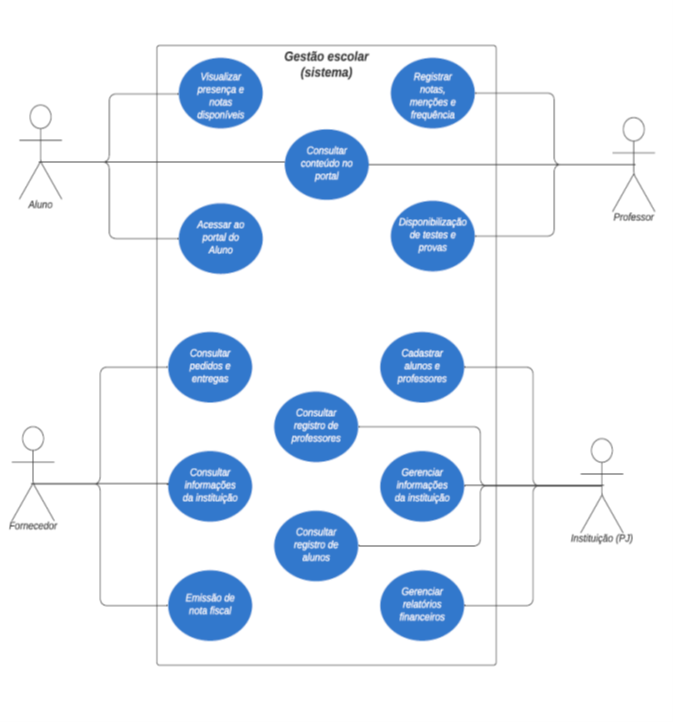
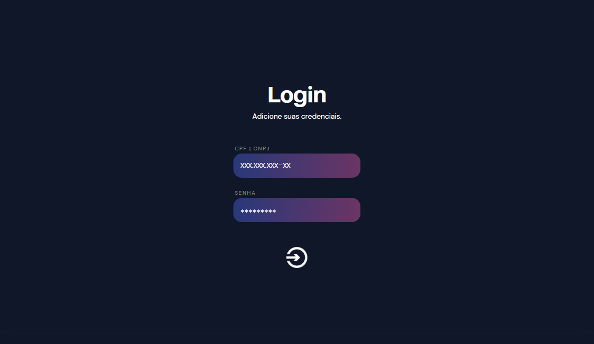
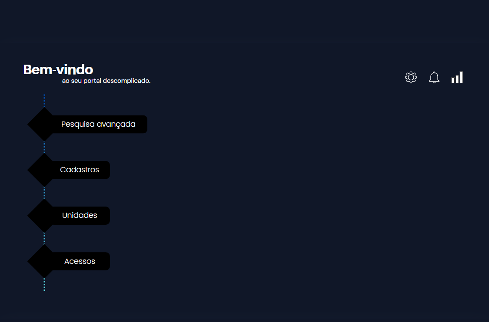
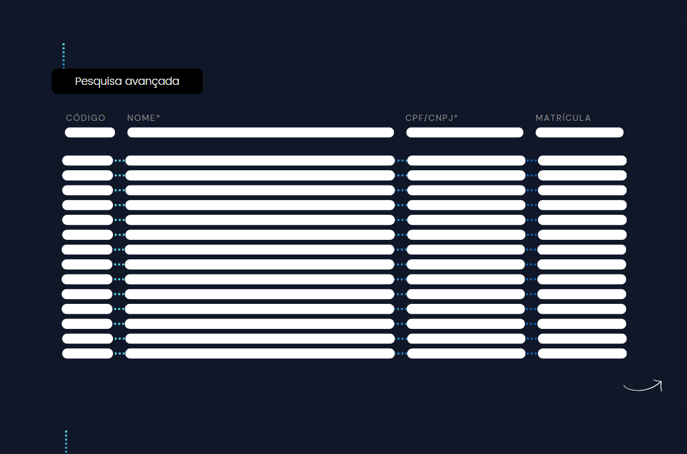
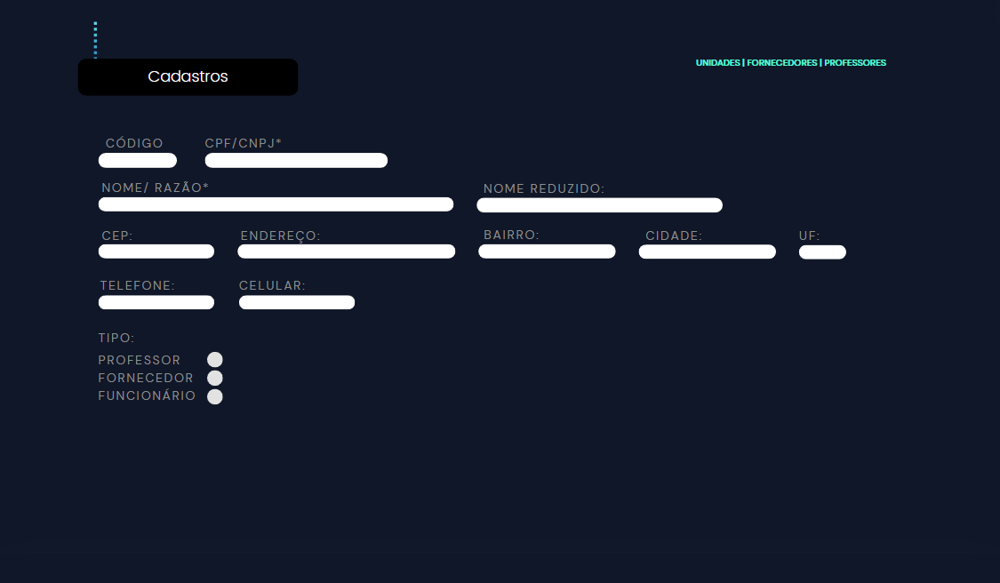

# Descrição
Esse repositório traz documentos e imagens referentes ao trabalho final da disciplina *Projeto Integrador III: Desenvolvimento de Sistemas Orientados a Objetos* do curso de **Análise e Desenvolvimento de Sistemas**, dentro do **Centro Universitário Senac**. Os integrantes do **grupo 01** são:
* [Alessandro Alves Damasceno](https://github.com/alessandroAlves1)
* [Ana Cláudia de Souza Santos ](https://github.com/souzsana)
* [Carolina Moreira Batatinha de Souza ](https://github.com/CarolinaBatatinha)
* [Elen Alice dos Reis Nicolini ](https://github.com/ElenReis)
* [Nathan Barros de Assis](https://github.com/onatao)

# Primeira entrega
É possível acessar o documento da **primeira entrega** do nosso Projeto Integrador no [link](documentos/PI_grupo1_1a_entrega.pdf).

# Diagrama de casos de uso
Desenvolvemos o diagrama de casos de uso a seguir.

# Diagrama de classes

Para o nosso projeto, foi desenvolvido o diagrama de classes abaixo.

# Protótipo da interface

Os protótipos utilizados na apresentação desse projeto estão exibidos dentro [desse link](https://www.canva.com/design/DAGD2GWjYlE/fhzBC3sYnMVQfTolxYQGvw/edit) na plataforma **Canva** e estão representados nas capturas abaixo:

- [x] **Tela de acesso 1**:   
*Representa a página inicial, onde o usuário opta por qual perfil ele utilizará.*

- [x] **Tela de acesso 2**:  
*Demonstra a tela de login.*

- [x] **Tela de acesso 3**:   
*Ilustra as opções de pesquisa dentro da plataforma.*

- [x] **Tela de acesso 4**:  
*Ilustra as opções avançadas de pesquisa dentro da plataforma.*

- [x] **Tela de acesso 5**:
*Disponibiliza a tela de cadastro para professores, fornecedores e funcionários.*

- [x] **Tela de acesso 6**:  
*Representa a tela de acessos.*

